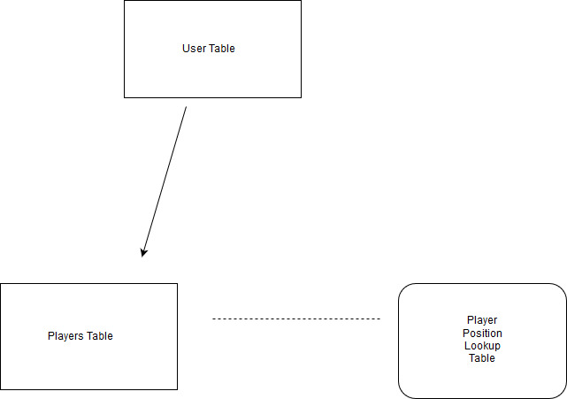

# Database Design for Final Fantasy Football

* Users can have multiple teams

* Teams pull players by ID and fill slots of "player one, player two, etc..." this way

* players populate with lookup tables of player types, this allows for easy querying and organizing

* players will have an enumerated status that can be changed manually or automatically, this will 
then make teams status as valid or invalid, prompting a change in the team

###User Team table contains these fields
* 8 Player fields
* Team name

##Player table contains these fields
* First Name
* Last Name
* Player Position
* Total yards
* Passing Yards
* Rushing Yards
* Receiving Yards
* Touchdowns
* Interceptions
* Sacks

##Player Position table contains these fields
* Player Position